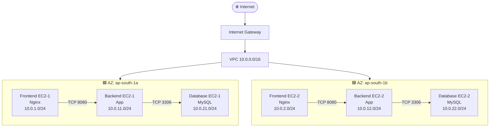
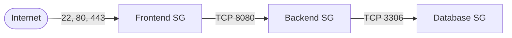
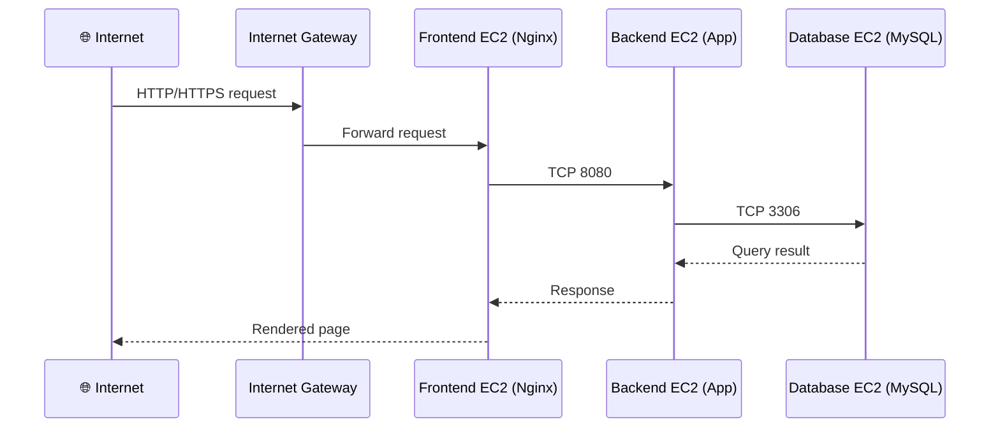
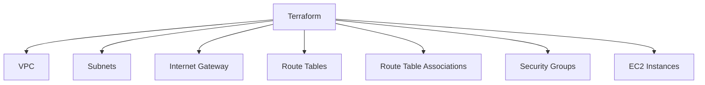
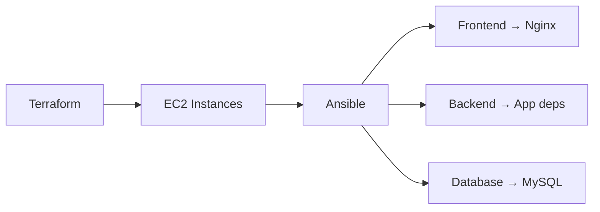
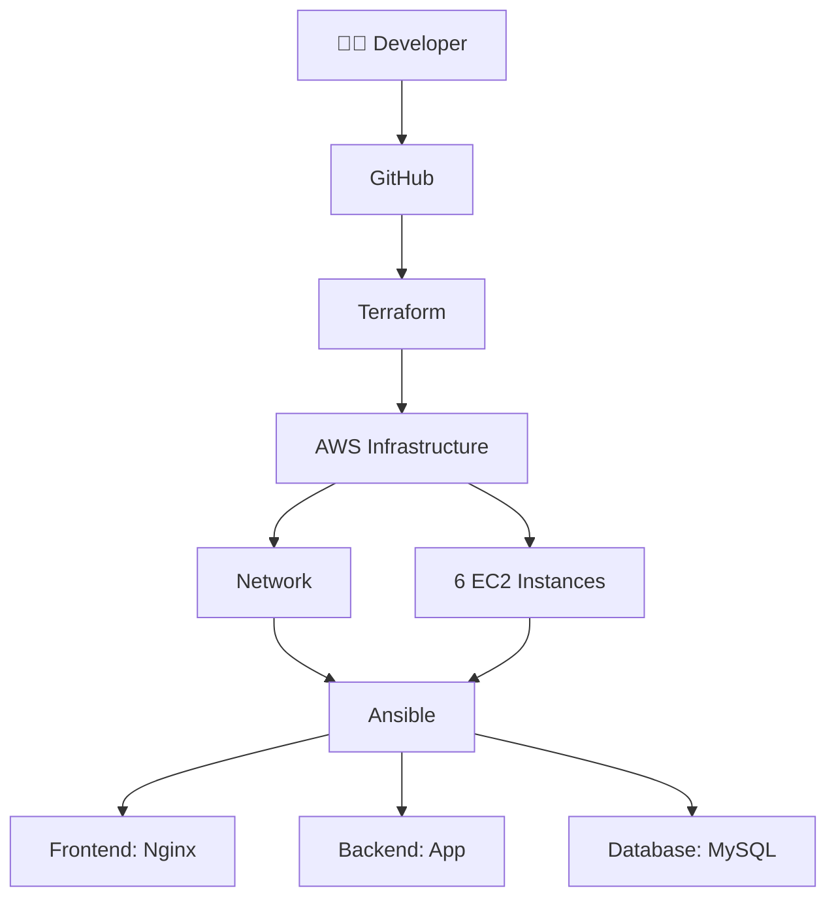
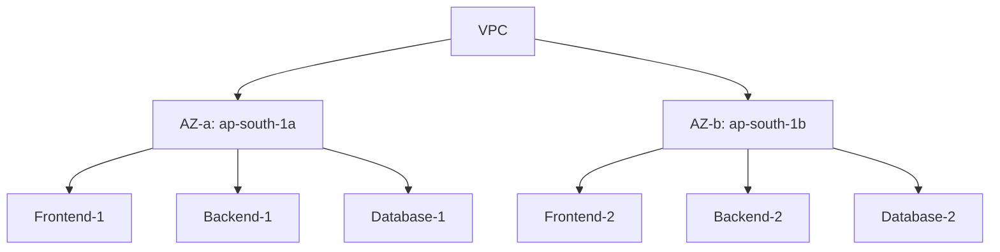
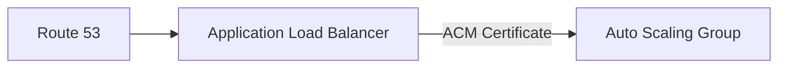
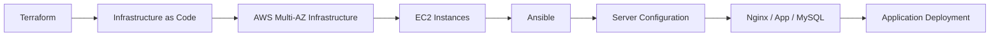

<div align="center">

# 🏗️ AWS Multi-AZ Infrastructure with Terraform & Ansible

### Production-style, multi-tier, multi-AZ AWS infrastructure — provisioned with Terraform, configured with Ansible.

[](https://www.terraform.io/)
[](https://aws.amazon.com/)
[](https://www.ansible.com/)
[](https://www.mysql.com/)
[](https://nginx.org/)
[](https://ubuntu.com/)

[](#-license)
[](#)
[](#-project-status)

<!--
  🎬 DEMO GIF
  Record a short terminal walkthrough of `terraform apply` + the app coming
  online with a tool like Terminalizer, asciinema+agg, or ScreenToGif, then
  drop the file in a `docs/` or `assets/` folder and point the line below at
  it, e.g. docs/demo.gif. GitHub will render it inline automatically.
-->
<!--  -->

</div>

---

## 📖 Table of Contents

- [Overview](#-project-overview)
- [Architecture](#️-architecture)
- [Network Design](#-network-architecture)
- [EC2 Layout](#️-ec2-architecture)
- [Security Groups](#-security-group-architecture)
- [Traffic Flow](#-application-traffic-flow)
- [Terraform Structure](#️-terraform-architecture)
- [Configuration](#️-terraform-configuration)
- [Deployment](#-deploy-infrastructure)
- [Ansible Configuration](#-ansible-configuration)
- [MySQL Setup](#️-mysql-configuration)
- [Workflow](#-terraform--ansible-workflow)
- [Multi-AZ Design](#-multi-az-design)
- [HA Notes](#️-database-high-availability-note)
- [Production Roadmap](#-production-improvements)
- [Infrastructure Summary](#-current-infrastructure-summary)
- [Learning Objectives](#-learning-objectives)
- [Useful Commands](#-useful-terraform-commands)
- [Project Status](#-project-status)
- [Author](#-author)

---

## 📌 Project Overview

This project demonstrates how to build a **multi-AZ, multi-tier AWS infrastructure using Terraform** and configure the provisioned EC2 instances using **Ansible**.

The infrastructure is designed with separate **Frontend, Backend, and Database tiers** distributed across two Availability Zones for better availability and fault isolation.

| | |
|---|---|
| **Cloud** | AWS (`ap-south-1`) |
| **Provisioning** | Terraform (modular) |
| **Configuration** | Ansible |
| **Tiers** | Frontend (Nginx) → Backend (App) → Database (MySQL) |
| **Availability** | 2 Availability Zones, 6 EC2 instances |

### Technologies Used

`AWS` · `Terraform` · `Ansible` · `EC2` · `VPC` · `Internet Gateway` · `Subnets` · `Route Tables` · `Security Groups` · `MySQL` · `Linux / Ubuntu` · `Git & GitHub`

---

## 🏗️ Architecture



---

## 🌐 Network Architecture

```text
VPC CIDR: 10.0.0.0/16
Region:   ap-south-1
AZs:      ap-south-1a, ap-south-1b
```

### Subnet Design

| Tier               | AZ-a             | AZ-b             |
|--------------------|------------------|------------------|
| 🌍 Public           | `10.0.1.0/24`   | `10.0.2.0/24`   |
| 🔒 Private / Backend | `10.0.11.0/24`  | `10.0.12.0/24`  |
| 🗄️ Database         | `10.0.21.0/24`  | `10.0.22.0/24`  |

- **Public subnets** host the frontend EC2 instances behind the Internet Gateway.
- **Private subnets** host backend application servers, reachable only from the frontend tier.
- **Database subnets** host MySQL, reachable only from the backend tier.

---

## 🖥️ EC2 Architecture

This project provisions **6 EC2 instances** across two Availability Zones:

| Role | Instance | AZ | Subnet |
|---|---|---|---|
| Frontend | `frontend-ec2-1` | ap-south-1a | `10.0.1.0/24` |
| Frontend | `frontend-ec2-2` | ap-south-1b | `10.0.2.0/24` |
| Backend | `backend-ec2-1` | ap-south-1a | `10.0.11.0/24` |
| Backend | `backend-ec2-2` | ap-south-1b | `10.0.12.0/24` |
| Database | `database-ec2-1` | ap-south-1a | `10.0.21.0/24` |
| Database | `database-ec2-2` | ap-south-1b | `10.0.22.0/24` |

> Database EC2 instances run **MySQL**, installed and configured via Ansible.

---

## 🔐 Security Group Architecture



| Security Group | Inbound Rules | Source |
|---|---|---|
| **Frontend SG** | `22` SSH, `80` HTTP, `443` HTTPS | Internet |
| **Backend SG** | `22` SSH, `8080` App traffic | Frontend SG |
| **Database SG** | `22` SSH, `3306` MySQL | Backend SG |

This design uses **Security Group-to-Security Group** communication instead of relying on fixed private IP addresses — each tier only accepts traffic from the SG of the tier in front of it.

---

## 🔄 Application Traffic Flow



Only the required communication paths are opened between tiers — no tier can be reached by skipping the one in front of it.

---

## 🏗️ Terraform Architecture



### Project Structure

```text
terraform/
│
├── main.tf
├── variables.tf
├── outputs.tf
├── provider.tf
│
├── module/
│   ├── vpc/
│   │   ├── main.tf
│   │   ├── variables.tf
│   │   └── outputs.tf
│   │
│   ├── security_group/
│   │   ├── main.tf
│   │   ├── variables.tf
│   │   └── outputs.tf
│   │
│   └── ec2/
│       ├── main.tf
│       ├── variables.tf
│       └── outputs.tf
│
└── README.md
```

### Module Responsibilities

<table>
<tr><td>

**VPC Module**
- VPC
- Public / private / database subnets
- Internet Gateway
- Route Tables & Associations

</td><td>

**Security Group Module**
- Frontend SG
- Backend SG
- Database SG
- Tier-to-tier rules

</td><td>

**EC2 Module**
- Frontend / Backend / Database instances
- AZ placement
- Subnet placement
- SG association

</td></tr>
</table>

---

## ⚙️ Terraform Configuration

```hcl
# Region
aws_region = "ap-south-1"

# VPC
vpc_cidr = "10.0.0.0/16"

# EC2
ami_id        = "ami-01a00762f46d584a1"
instance_type = "t3.medium"
key_name      = "Dhadi"
```

---

## 🚀 Deploy Infrastructure

### 1️⃣ Clone the repository

```bash
git clone https://github.com/ajaydhadi95-gif/terraform-aws-modular-infrastructure.git
cd terraform-aws-modular-infrastructure
```

### 2️⃣ Initialize Terraform

```bash
terraform init
```

### 3️⃣ Format the code

```bash
terraform fmt -recursive
```

### 4️⃣ Validate the configuration

```bash
terraform validate
```

```text
Success! The configuration is valid.
```

### 5️⃣ Create an execution plan

```bash
terraform plan
```

The current plan creates **26 resources**, including:

- 1 VPC
- 6 Subnets
- 1 Internet Gateway
- 3 Route Tables
- 6 Route Table Associations
- 3 Security Groups
- 6 EC2 Instances

### 6️⃣ Apply the infrastructure

```bash
terraform apply
```

Confirm with:

```text
yes
```

---

## 🔧 Ansible Configuration

Terraform provisions the infrastructure; **Ansible configures the EC2 servers**.



**Example inventory:**

```ini
[frontend]
frontend-ec2-1
frontend-ec2-2

[backend]
backend-ec2-1
backend-ec2-2

[database]
database-ec2-1
database-ec2-2
```

---

## 🗄️ MySQL Configuration

MySQL runs directly on the Database EC2 instances. Ansible is used to:

- ✅ Install MySQL
- ✅ Start & enable the MySQL service
- ✅ Create databases
- ✅ Create database users
- ✅ Configure permissions
- ✅ Configure MySQL settings

**Example task:**

```yaml
- name: Install MySQL
  apt:
    name: mysql-server
    state: present
    update_cache: yes
```

---

## 🧩 Terraform + Ansible Workflow



---

## 🌍 Multi-AZ Design



**Benefits:**

- ✅ Availability Zone separation
- ✅ Fault isolation
- ✅ Better foundation for scaling
- ✅ Reduced dependency on a single AZ

---

## ⚠️ Database High Availability Note

> **Heads up:** running two Database EC2 instances does **not** automatically provide MySQL replication or failover.

For real database high availability, replication/failover must be configured separately. In a production environment, consider **Amazon RDS for MySQL with Multi-AZ** instead of self-managed EC2 databases.

---

## 🏭 Production Improvements

This project is a **production-style learning architecture**. Before real production use, consider adding:

| # | Improvement | Purpose |
|---|---|---|
| 1 | **Application Load Balancer** | Distribute traffic across frontend EC2 instances instead of hitting them directly |
| 2 | **Auto Scaling Group** | Scale application servers automatically with demand |
| 3 | **NAT Gateway** | Controlled outbound internet access for private instances |
| 4 | **Amazon RDS (Multi-AZ)** | Managed, highly available database layer |
| 5 | **AWS Systems Manager** | Replace direct SSH access with SSM Session Manager |
| 6 | **AWS Secrets Manager** | Store DB credentials securely, out of app config |
| 7 | **CloudWatch** | Metrics, logs, and alarms for operational visibility |
| 8 | **Terraform Remote State** | Shared state with locking for team environments |
| 9 | **HTTPS via ACM + Route 53** | Secure traffic end-to-end through the ALB |



---

## 📊 Current Infrastructure Summary

| Component | Quantity |
|---|---:|
| VPC | 1 |
| Availability Zones | 2 |
| Public Subnets | 2 |
| Private Subnets | 2 |
| Database Subnets | 2 |
| Internet Gateway | 1 |
| Route Tables | 3 |
| Security Groups | 3 |
| Frontend EC2 | 2 |
| Backend EC2 | 2 |
| Database EC2 | 2 |
| **Total EC2** | **6** |

---

## 🎯 Learning Objectives

This project demonstrates practical, hands-on knowledge of:

- AWS VPC & CIDR planning
- Multi-AZ architecture design
- Public / private / database subnet segmentation
- Route Tables & Internet Gateway
- Security Groups (tier-to-tier)
- EC2 provisioning at scale
- Terraform modules, variables & outputs
- Infrastructure as Code practices
- Ansible configuration management
- MySQL deployment
- Tier-based application architecture
- AWS security fundamentals
- High availability concepts

---

## 🧪 Useful Terraform Commands

```bash
terraform init          # Initialize the working directory
terraform fmt -recursive # Format all .tf files
terraform validate      # Validate configuration syntax
terraform plan          # Preview changes
terraform apply         # Apply changes
terraform destroy       # ⚠️ Tear down all managed resources
```

> **Warning:** `terraform destroy` permanently deletes all Terraform-managed AWS resources.

---

## 📌 Project Status

- [x] AWS VPC
- [x] Multi-AZ network
- [x] Public subnets
- [x] Private subnets
- [x] Database subnets
- [x] Internet Gateway
- [x] Route Tables
- [x] Security Groups
- [x] Terraform Modules
- [x] 6 EC2 architecture
- [x] Terraform validation
- [x] Terraform plan
- [ ] MySQL configuration with Ansible
- [ ] Backend application deployment
- [ ] Frontend deployment
- [ ] Application end-to-end testing
- [ ] MySQL replication/failover
- [ ] Application Load Balancer
- [ ] Auto Scaling
- [ ] RDS Multi-AZ

---

## 👨‍💻 Author

**Ajay Dhadi**

AWS · DevOps · Terraform · Ansible · Jenkins · Docker · Kubernetes

[](https://github.com/ajaydhadi95-gif)

---

## ⭐ Conclusion



This architecture provides a strong foundation for learning cloud infrastructure and can be extended toward a fully production-oriented AWS environment using **ALB, Auto Scaling, NAT Gateway, RDS Multi-AZ, CloudWatch, Secrets Manager, and CI/CD**.

<div align="center">

**⭐ If this project helped you, consider giving it a star! ⭐**

</div>
