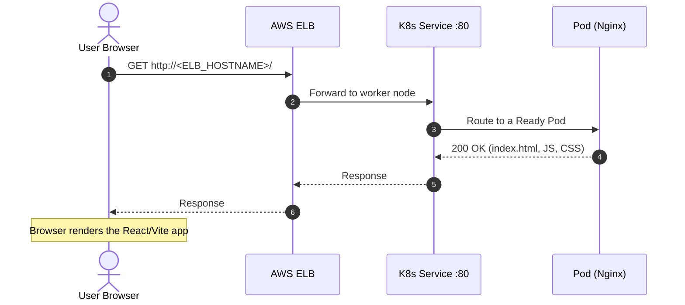
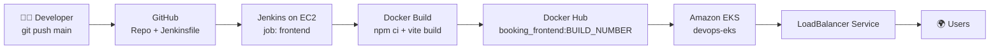
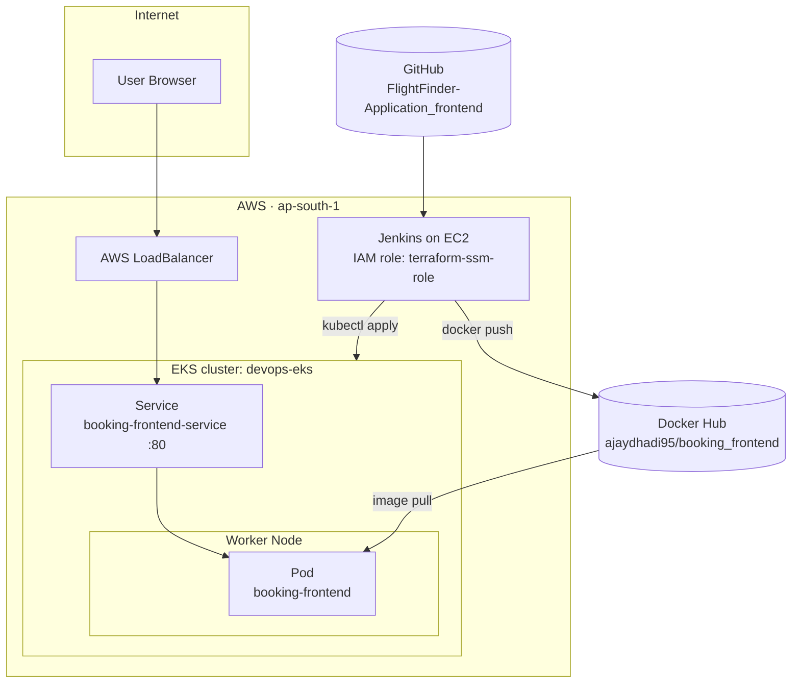

# AWS DevOps Infrastructure

## Live AWS Infrastructure Diagram

This project uses Terraform to provision AWS infrastructure in the `ap-south-1` region.

### Architecture Diagram

[**Open Animated AWS Infrastructure Diagram**](./index.html)

### Architecture Components

* Amazon VPC and subnets
* Amazon EKS and Kubernetes workloads
* AWS Load Balancer
* Jenkins EC2 for CI/CD
* NAT Gateway for outbound internet access
* Amazon RDS MySQL in private subnets

### Region

`ap-south-1` (Mumbai)

### Infrastructure as Code

Terraform


# ✈️ FlightFinder Frontend — CI/CD on Amazon EKS

**React + Vite frontend, built by Jenkins, packaged with Docker, stored on Docker Hub and served from Amazon EKS behind an AWS LoadBalancer.**


<sub>👆 Live user flow — a visitor's request travelling to the Pod and the response coming back.</sub>

</div>

---

## 📑 Table of Contents

1. [Overview](#-overview)
2. [User Flow (how users come and go)](#-user-flow-how-users-come-and-go)
3. [CI/CD Flow](#-cicd-flow)
4. [Architecture](#-architecture)
5. [Tech Stack](#-tech-stack)
6. [Project Configuration](#-project-configuration)
7. [Repository Structure](#-repository-structure)
8. [Prerequisites](#-prerequisites)
9. [Setup Guide](#-setup-guide)
10. [Jenkins Pipeline Stages](#-jenkins-pipeline-stages)
11. [Deployment Commands](#-deployment-commands)
12. [Verify the Deployment](#-verify-the-deployment)
13. [Troubleshooting](#-troubleshooting)
14. [Security Notes](#-security-notes)
15. [Roadmap](#-roadmap)
16. [Author](#-author)

---

## 🔎 Overview

This project automatically deploys the **FlightFinder** React/Vite frontend to **Amazon EKS**.

| Tool | Role |
|------|------|
| **GitHub** | Stores the source code and `Jenkinsfile` |
| **Jenkins (on EC2)** | Runs the automated build and deploy pipeline |
| **Docker** | Packages the app into a multi-stage image (Node build → Nginx runtime) |
| **Docker Hub** | Stores the built image |
| **Amazon EKS** | Runs the containers using Kubernetes |
| **AWS LoadBalancer** | Gives users an external entry point |
| **Browser** | Where the user opens the website |

---

## 🌐 User Flow (how users come and go)

<div align="center">

</div>

**Request path (user comes in):**

1. The user opens the LoadBalancer URL in the browser → `HTTP GET /`
2. The **AWS ELB** forwards the traffic to a healthy EKS worker node
3. The **Kubernetes Service** (`booking-frontend-service`, port `80`) picks a Ready Pod
4. **Nginx** inside the Pod serves the built Vite files from `dist/`

**Response path (user gets the page):**

5. Nginx returns `index.html` + JS/CSS (`200 OK`)
6. The response goes back through the Service and the ELB
7. The browser renders the React UI


```mermaid
sequenceDiagram
    autonumber
    actor U as User Browser
    participant E as AWS ELB
    participant S as K8s Service :80
    participant P as Pod (Nginx)
    U->>E: GET http://<ELB_HOSTNAME>/
    E->>S: Forward to worker node
    S->>P: Route to a Ready Pod
    P-->>S: 200 OK (index.html, JS, CSS)
    S-->>E: Response
    E-->>U: Response
    Note over U: Browser renders the React/Vite app
```

---

## 🔁 CI/CD Flow

<div align="center">

</div>


```mermaid
flowchart LR
    A[👨‍💻 Developer<br/>git push main] --> B[GitHub<br/>Repo + Jenkinsfile]
    B --> C[Jenkins on EC2<br/>job: frontend]
    C --> D[Docker Build<br/>npm ci + vite build]
    D --> E[Docker Hub<br/>booking_frontend:BUILD_NUMBER]
    E --> F[Amazon EKS<br/>devops-eks]
    F --> G[LoadBalancer Service]
    G --> H[🌍 Users]
```

> ⚠️ A push to GitHub starts the pipeline **only if** a webhook or polling trigger is configured. See the [Roadmap](#-roadmap).

---

## 🏗️ Architecture


```mermaid
flowchart TB
    subgraph Internet
        U[User Browser]
    end
    subgraph AWS["AWS · ap-south-1"]
        ELB[AWS LoadBalancer]
        subgraph EKS["EKS cluster: devops-eks"]
            SVC[Service<br/>booking-frontend-service :80]
            subgraph Node1[Worker Node]
                P1[Pod<br/>booking-frontend]
            end
        end
        JK[Jenkins on EC2<br/>IAM role: terraform-ssm-role]
    end
    DH[(Docker Hub<br/>ajaydhadi95/booking_frontend)]
    GH[(GitHub<br/>FlightFinder-Application_frontend)]

    U --> ELB --> SVC --> P1
    GH --> JK
    JK -- docker push --> DH
    JK -- kubectl apply --> EKS
    DH -- image pull --> P1
```

---

## 🧰 Tech Stack

- **Frontend:** React, Vite, Node.js 22
- **Web server:** Nginx (Alpine)
- **Containerization:** Docker (multi-stage build)
- **CI/CD:** Jenkins (Pipeline script from SCM)
- **Registry:** Docker Hub
- **Orchestration:** Kubernetes on Amazon EKS
- **Cloud:** AWS (EC2, IAM, EKS, ELB) in `ap-south-1`

---

## ⚙️ Project Configuration

| Component | Value |
|-----------|-------|
| AWS Region | `ap-south-1` |
| Jenkins job | `frontend` |
| Jenkins workspace | `/var/lib/jenkins/workspace/frontend` |
| GitHub repository | `FlightFinder-Application_frontend` |
| Git branch | `main` |
| EKS cluster | `devops-eks` |
| Docker Hub image | `ajaydhadi95/booking_frontend:<BUILD_NUMBER>` |
| Kubernetes Deployment | `booking-frontend` |
| Kubernetes Service | `booking-frontend-service` |
| Service type / port | `LoadBalancer` / `80` |
| Jenkins IAM role | `terraform-ssm-role` |

---

## 📂 Repository Structure

```text
FlightFinder-Application_frontend/
├── Jenkinsfile          # CI/CD pipeline definition
├── Dockerfile           # Multi-stage build (Node → Nginx)
├── nginx.conf           # Nginx config for serving the SPA
├── package.json         # Dependencies and scripts
├── src/                 # React/Vite source code
├── README.md
└── docs/
    └── images/
        ├── user-flow.gif    # Animated user request/response flow
        └── cicd-flow.gif    # Animated CI/CD flow
```

---

## ✅ Prerequisites

On the **Jenkins EC2 instance**:

```bash
git --version
docker --version
aws --version
kubectl version --client
java -version
```

Also required:

- Jenkins credential `dockerhub-credentials` (username + access token)
- An IAM role on the EC2 instance that can call the EKS APIs
- Kubernetes access for the Jenkins user inside the cluster (IAM and Kubernetes permissions are **separate**)

---

## 🚀 Setup Guide

### 1. Confirm AWS identity and cluster status

```bash
aws sts get-caller-identity

aws eks describe-cluster \
  --region ap-south-1 \
  --name devops-eks \
  --query "cluster.status" \
  --output text        # expected: ACTIVE
```

### 2. Create the kubeconfig

```bash
aws eks update-kubeconfig \
  --region ap-south-1 \
  --name devops-eks
```

### 3. Give the `jenkins` Linux user its own kubeconfig

Jenkins runs jobs as the `jenkins` user, not as `ubuntu`.

```bash
sudo mkdir -p /var/lib/jenkins/.kube

sudo cp /home/ubuntu/.kube/config \
  /var/lib/jenkins/.kube/config

sudo chown -R jenkins:jenkins /var/lib/jenkins/.kube
sudo chmod 700 /var/lib/jenkins/.kube
sudo chmod 600 /var/lib/jenkins/.kube/config
```

Test it as the Jenkins user:

```bash
sudo -u jenkins env KUBECONFIG=/var/lib/jenkins/.kube/config kubectl get nodes
sudo -u jenkins env KUBECONFIG=/var/lib/jenkins/.kube/config kubectl get pods -A
```

Both worker nodes should show `Ready`.

### 4. Create the Jenkins job

- Type: **Pipeline**
- Definition: **Pipeline script from SCM**
- Repository: `FlightFinder-Application_frontend`
- Branch: `main`
- Script path: `Jenkinsfile`

---

## 🧪 Jenkins Pipeline Stages

| # | Stage | Purpose |
|---|-------|---------|
| 1 | **Checkout** | `checkout scm` — get code from the same repo the job uses |
| 2 | **Verify Project** | `test -f package.json`, `Dockerfile`, `nginx.conf` |
| 3 | **Build Docker Image** | `docker build -t ajaydhadi95/booking_frontend:$BUILD_NUMBER .` |
| 4 | **Push Image to Docker Hub** | Login with stored credentials, `docker push`, `docker logout` |
| 5 | **Connect to EKS** | Configure and test cluster access |
| 6 | **Deploy to EKS** | Create/update the Deployment and Service, wait for rollout |

Secure Docker Hub login used in the pipeline:

```groovy
withCredentials([
    usernamePassword(
        credentialsId: 'dockerhub-credentials',
        usernameVariable: 'DOCKERHUB_USER',
        passwordVariable: 'DOCKERHUB_TOKEN'
    )
]) {
    sh '''
        echo "$DOCKERHUB_TOKEN" | docker login \
          -u "$DOCKERHUB_USER" \
          --password-stdin

        docker push ${IMAGE_NAME}:${IMAGE_TAG}

        docker logout
    '''
}
```

---

## ☸️ Deployment Commands

**Create or update the Deployment**

```bash
kubectl create deployment booking-frontend \
  --image=ajaydhadi95/booking_frontend:<TAG> \
  --dry-run=client -o yaml | kubectl apply -f -
```

**Update the image** (the container name on the left must match the *actual container name*, not just the Deployment name)

```bash
kubectl get deployment booking-frontend \
  -o jsonpath='{.spec.template.spec.containers[0].name}'

kubectl set image deployment/booking-frontend \
  <CONTAINER_NAME>=ajaydhadi95/booking_frontend:<TAG>
```

**Wait for the rollout**

```bash
kubectl rollout status deployment/booking-frontend --timeout=180s
```

**Expose through a LoadBalancer**

```bash
kubectl expose deployment booking-frontend \
  --name=booking-frontend-service \
  --type=LoadBalancer \
  --port=80 \
  --target-port=80 \
  --dry-run=client -o yaml | kubectl apply -f -
```

---

## 🔍 Verify the Deployment

```bash
kubectl get nodes
kubectl get deployments
kubectl get pods -o wide
kubectl get svc booking-frontend-service
kubectl get svc booking-frontend-service -w     # watch until EXTERNAL-IP is assigned
```

Healthy output looks like:

| Check | Expected |
|-------|----------|
| Nodes | `Ready` |
| Pod | `1/1  Running` |
| Service | `TYPE: LoadBalancer` with an `EXTERNAL-IP` hostname |

Finally, open it in your browser:

```text
http://<ELB_HOSTNAME>
```

> The hostname being assigned does not guarantee the site is reachable yet. **The browser test is the final check**, including any API-dependent features.

---

## 🛠️ Troubleshooting

| Problem | What to check / fix |
|---------|---------------------|
| Jenkins can't reach Kubernetes | Make sure `/var/lib/jenkins/.kube/config` exists and is owned by `jenkins` |
| AWS auth errors | `aws sts get-caller-identity` — verify the EC2 IAM role |
| `Project files verified` fails | Confirm `package.json`, `Dockerfile`, `nginx.conf` exist and the right repo is checked out |
| `error: unable to find container named "booking-frontend"` | Deployment name ≠ container name. Read it with the `jsonpath` command above |
| Image can't be pulled | Confirm the push succeeded (`digest: sha256:...`) and the tag matches |
| Docker credentials warning | Security warning about `/var/lib/jenkins/.docker/config.json`, **not** a failed push |
| Site not loading | Wait for ELB provisioning, then check `kubectl get svc` and `kubectl describe svc booking-frontend-service` |

Useful debugging commands:

```bash
kubectl describe pod <POD_NAME>
kubectl logs deployment/booking-frontend
kubectl logs deployment/booking-frontend --previous
kubectl describe deployment booking-frontend
kubectl describe svc booking-frontend-service
```

---

## 🔐 Security Notes

- Never commit Docker Hub passwords/tokens — use Jenkins credentials (`withCredentials`).
- Use `--password-stdin` for `docker login`, and `docker logout` after the push.
- Keep kubeconfig permissions strict (`700` directory, `600` file).
- Restrict the Jenkins port (`8080`) in the EC2 security group to trusted IPs.
- Use least-privilege IAM and Kubernetes RBAC for the Jenkins role.
- Don't publish real Jenkins IPs or LoadBalancer hostnames in a public README.

---

## 🗺️ Roadmap

- [ ] GitHub webhook trigger so a `git push` starts the pipeline automatically
- [ ] HTTPS with ACM + Ingress (AWS Load Balancer Controller) and a custom domain
- [ ] Replace `latest`-style manual tagging with immutable tags + automatic rollback on failed rollout
- [ ] Add readiness/liveness probes and resource requests/limits
- [ ] Horizontal Pod Autoscaler for traffic spikes
- [ ] Move manifests into versioned YAML / Helm chart

---

## 👤 Author

**Ajay Dhadi** — AWS · DevOps · Cloud · Infrastructure as Code

GitHub: [@ajaydhadi95-gif](https://github.com/ajaydhadi95-gif)

---

<div align="center">

⭐ If this runbook helped you, give the repo a star!

</div>