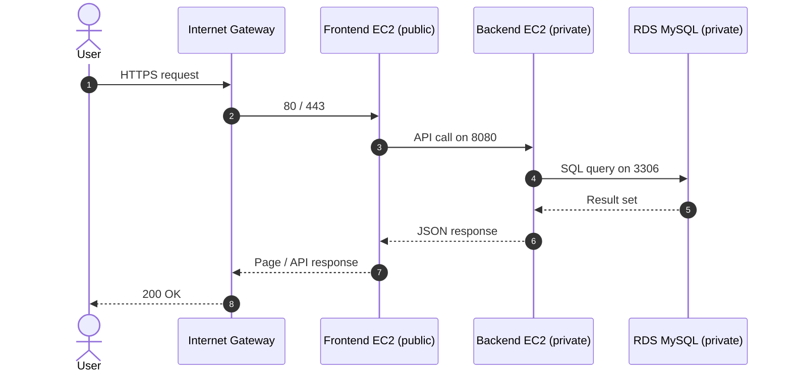
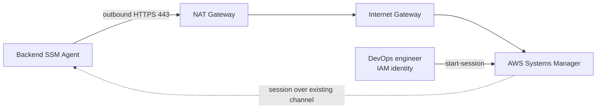

<div align="center">

# AWS Three-Tier Architecture with Terraform

**A secure, modular, production-style three-tier infrastructure on AWS, provisioned entirely with Terraform.**


<br/>


<sub>Animated walkthrough: user request (blue) → response (green) → DevOps access through SSM (purple / pink)</sub>

</div>

---


## Table of Contents

- [Overview](#overview)
- [Architecture](#architecture)
- [Traffic Flow](#traffic-flow)
- [Administrative Access (No SSH)](#administrative-access-no-ssh)
- [Security Design](#security-design)
- [Tech Stack](#tech-stack)
- [Project Structure](#project-structure)
- [Getting Started](#getting-started)
- [Connecting to the Backend with SSM](#connecting-to-the-backend-with-ssm)
- [Terraform Outputs](#terraform-outputs)
- [Cost Awareness](#cost-awareness)
- [Cleanup](#cleanup)
- [Known Limitations and Roadmap](#known-limitations-and-roadmap)
- [Author](#author)

---

## Overview

This project provisions a complete **three-tier web application infrastructure** on AWS using **Terraform modules**.

| Tier | Component | Location | Exposure |
|---|---|---|---|
| Presentation | Frontend EC2 (`t3.medium`) | Public subnet | Internet (HTTP / HTTPS) |
| Application | Backend EC2 (`t3.medium`) | Private subnet | Frontend only (port 8080) |
| Data | RDS MySQL 8.0 (`db.t3.micro`) | Private DB subnets (2 AZs) | Backend only (port 3306) |

**Highlights**

- Network isolation with a dedicated **VPC**, public, private and database subnets, and separate route tables
- **Security-group chaining**: Internet → Frontend → Backend → RDS (no CIDR-based access between tiers)
- **No public IP and no SSH** on the backend; administration happens through **AWS Systems Manager Session Manager**
- **NAT Gateway** for outbound-only internet access from the private tier
- **RDS** is private, encrypted at rest, and has automated backups enabled
- Fully reproducible with `terraform init && terraform apply`

---

## Architecture

<div align="center">
  
</div>

### Components

| Resource | Details |
|---|---|
| **VPC** | `10.0.0.0/16`, region `ap-south-1` |
| **Public subnet** | `10.0.1.0/24` (`ap-south-1a`), auto-assigns public IPs |
| **Private subnet** | `10.0.11.0/24` (`ap-south-1a`), no public IPs |
| **DB subnets** | `10.0.21.0/24` (`ap-south-1a`) and `10.0.22.0/24` (`ap-south-1b`) |
| **Internet Gateway** | Internet entry and exit for the public subnet |
| **NAT Gateway + Elastic IP** | Outbound internet for the private subnet |
| **Route tables** | Public → IGW, Private → NAT, Database → local only |
| **Frontend EC2** | Public tier, ports 80 and 443 |
| **Backend EC2** | Private tier, port 8080 from the frontend security group, SSM instance profile attached |
| **RDS MySQL 8.0** | `db.t3.micro`, 20 GB `gp3`, database `bookingdb`, encrypted, 7-day backups, `publicly_accessible = false` |
| **IAM** | Role with `AmazonSSMManagedInstanceCore` and an instance profile |

---

## Traffic Flow


```mermaid
sequenceDiagram
    autonumber
    actor U as User
    participant IGW as Internet Gateway
    participant FE as Frontend EC2 (public)
    participant BE as Backend EC2 (private)
    participant DB as RDS MySQL (private)

    U->>IGW: HTTPS request
    IGW->>FE: 80 / 443
    FE->>BE: API call on 8080
    BE->>DB: SQL query on 3306
    DB-->>BE: Result set
    BE-->>FE: JSON response
    FE-->>IGW: Page / API response
    IGW-->>U: 200 OK
```

| Step | From → To | Port | Allowed by |
|---|---|---|---|
| 1-2 | Internet → Frontend | 80, 443 | Frontend SG (`0.0.0.0/0`) |
| 3 | Frontend → Backend | 8080 | Backend SG (source: Frontend SG) |
| 4 | Backend → RDS | 3306 | RDS SG (source: Backend SG) |
| 5-8 | Response path | - | Security groups are stateful, no extra rules needed |

---

## Administrative Access (No SSH)

The backend has **no public IP and port 22 is closed**. DevOps engineers connect with **AWS Systems Manager Session Manager**:


```mermaid
flowchart LR
    A[Backend SSM Agent] -- "outbound HTTPS 443" --> B[NAT Gateway]
    B --> C[Internet Gateway]
    C --> D[AWS Systems Manager]
    E[DevOps engineer<br/>IAM identity] -- "start-session" --> D
    D -. "session over existing channel" .-> A
```

1. The SSM agent on the backend opens an **outbound** HTTPS connection through the NAT Gateway.
2. The engineer authenticates with **IAM** and starts a session.
3. SSM relays the session over that existing connection. **No inbound port, bastion host or SSH key is required**, and every session can be logged for audit.

---

## Security Design

- **Least-privilege network access**: each tier accepts traffic only from the tier directly above it, referenced by security group ID.
- **Private data tier**: RDS has no public endpoint, sits in subnets with no internet route, and accepts connections only from the backend security group.
- **Encryption at rest** is enabled on RDS (`storage_encrypted = true`).
- **Automated backups** are retained for 7 days.
- **Keyless administration** through SSM Session Manager instead of SSH.
- **Outbound-only internet** for the private tier through NAT.

---

## Tech Stack

| Category | Tools |
|---|---|
| Infrastructure as Code | Terraform (modular) |
| Cloud | AWS (VPC, EC2, RDS, IAM, NAT, IGW, Systems Manager) |
| Database | MySQL 8.0 |
| Region | `ap-south-1` (Mumbai) |

---

## Project Structure

> Adjust this tree to match your repository layout.

```text
.
├── main.tf                 # Root module wiring all child modules
├── variables.tf
├── outputs.tf
├── providers.tf
├── terraform.tfvars        # Local values (do not commit secrets)
├── docs/
│   ├── architecture.gif    # Animated walkthrough
│   └── architecture.png    # Static diagram
└── modules/
    ├── vpc/                # VPC, subnets, IGW, NAT, EIP, route tables
    ├── security_group/     # Frontend, backend and RDS security groups
    ├── iam/                # SSM role, policy attachment, instance profile
    ├── ec2/                # Frontend and backend instances
    └── rds/                # DB subnet group and MySQL instance
```

---

## Getting Started

### Prerequisites

- [Terraform](https://developer.hashicorp.com/terraform/install) `>= 1.5`
- [AWS CLI](https://docs.aws.amazon.com/cli/latest/userguide/getting-started-install.html) configured (`aws configure`)
- An AWS account with permissions for VPC, EC2, RDS and IAM
- [Session Manager plugin](https://docs.aws.amazon.com/systems-manager/latest/userguide/session-manager-working-with-install-plugin.html) for the AWS CLI

### Deploy

```bash
# 1. Clone the repository
git clone https://github.com/<your-username>/<your-repo>.git
cd <your-repo>

# 2. Provide your values (never commit real passwords)
cp terraform.tfvars.example terraform.tfvars

# 3. Initialise, review and apply
terraform init
terraform plan -out=tfplan
terraform apply tfplan
```

A successful plan reports **26 resources to add**.

> **Tip:** use `terraform plan -out=tfplan` and then `terraform apply tfplan` so that Terraform applies exactly the plan you reviewed.

---

## Connecting to the Backend with SSM

Check that the instance is registered:

```bash
aws ssm describe-instance-information --region ap-south-1
```

Open a shell on the private backend:

```bash
aws ssm start-session --target <backend-instance-id> --region ap-south-1
```

Optional: reach the private database from your laptop through a port-forwarding tunnel:

```bash
aws ssm start-session \
  --target <backend-instance-id> \
  --document-name AWS-StartPortForwardingSessionToRemoteHost \
  --parameters '{"host":["<rds-endpoint>"],"portNumber":["3306"],"localPortNumber":["3306"]}'
```

You can also connect from the console: **EC2 → Instances → Connect → Session Manager**.

---

## Terraform Outputs

| Output | Description |
|---|---|
| `vpc_id` | ID of the VPC |
| `vpc_cidr` | VPC CIDR block (`10.0.0.0/16`) |
| `frontend_1_id` | Frontend EC2 instance ID |
| `backend_1_id` | Backend EC2 instance ID (use with SSM) |
| `frontend_sg_id` | Frontend security group ID |
| `backend_sg_id` | Backend security group ID |
| `database_sg_id` | RDS security group ID |
| `rds_endpoint` | MySQL endpoint for the application |

---

## Cost Awareness

This stack creates billable resources: **NAT Gateway (hourly + data processing)**, **two `t3.medium` instances**, an **Elastic IP**, and an **RDS instance**. Review the [AWS Pricing Calculator](https://calculator.aws/) before applying, and destroy the environment when you are not using it.

---

## Cleanup

```bash
terraform destroy
```

---

## Known Limitations and Roadmap

This repository is a solid **learning and portfolio baseline**. Before using it for real production traffic, plan for the following.

- [ ] Restrict or remove the frontend **SSH (port 22)** rule and attach the SSM instance profile to the frontend as well
- [ ] Enforce **IMDSv2** on both instances (`http_tokens = "required"`)
- [ ] Add an **Application Load Balancer** with an ACM certificate (HTTPS) and move EC2 to private subnets
- [ ] Deploy across **multiple Availability Zones** with Auto Scaling groups
- [ ] Enable **RDS Multi-AZ**, deletion protection and a final snapshot
- [ ] Store DB credentials in **AWS Secrets Manager** (`manage_master_user_password`) or SSM Parameter Store
- [ ] Set `enable_dns_hostnames = true` on the VPC and consider **VPC endpoints** for SSM
- [ ] Use a **remote Terraform backend** (S3 + DynamoDB locking) and separate dev / stage / prod environments
- [ ] Add **CloudWatch alarms**, VPC Flow Logs and a CI/CD pipeline (`terraform fmt`, `validate`, `plan` on pull requests)

---


If this project helped you, consider giving it a ⭐

---

<div align="center">
<sub>Built with Terraform on AWS</sub>
</div>
